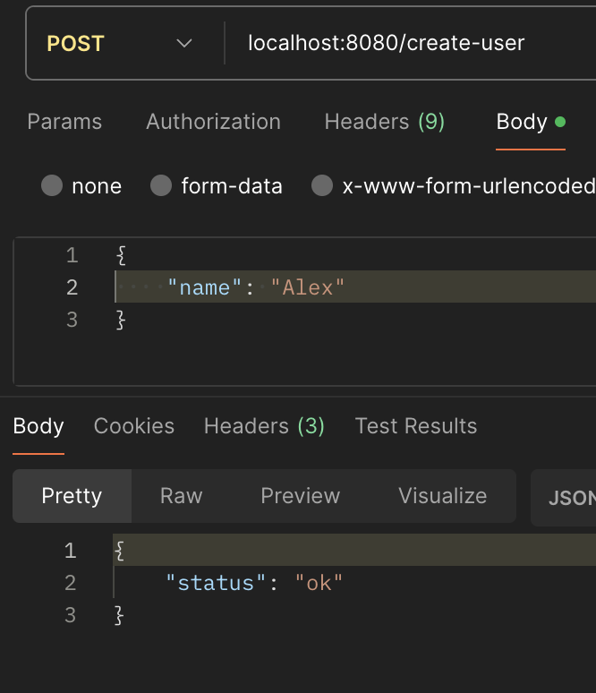
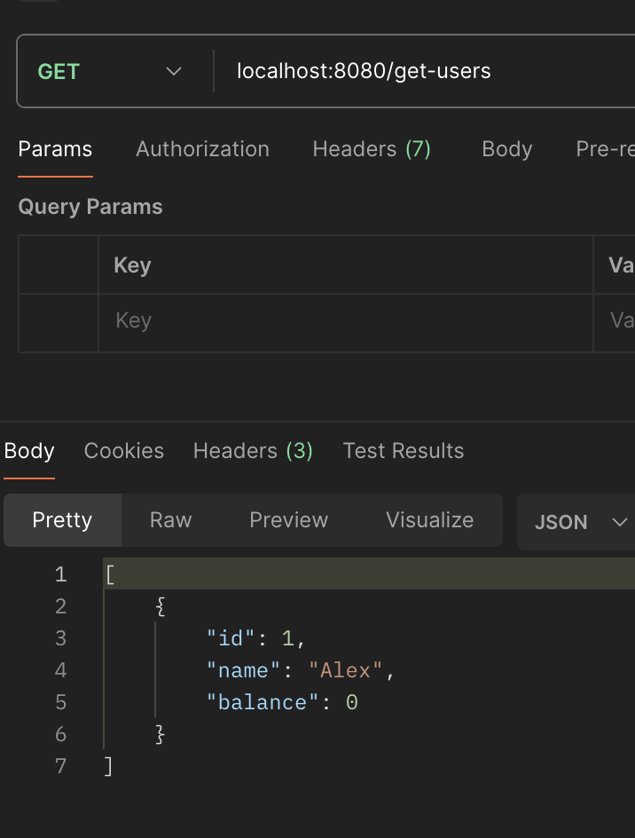
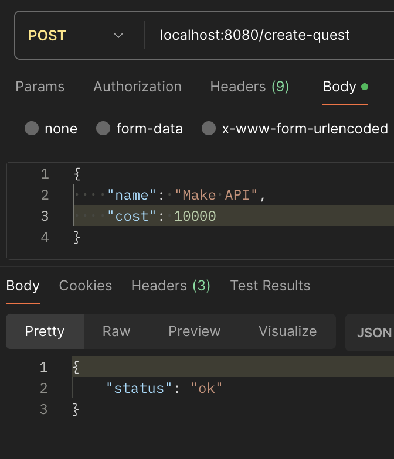
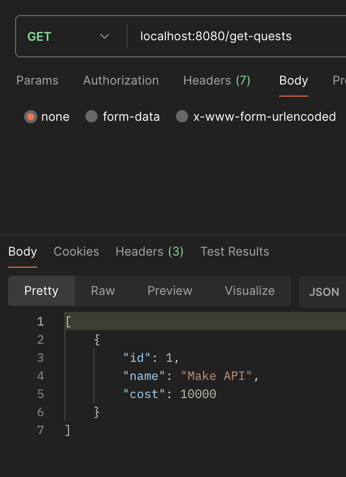
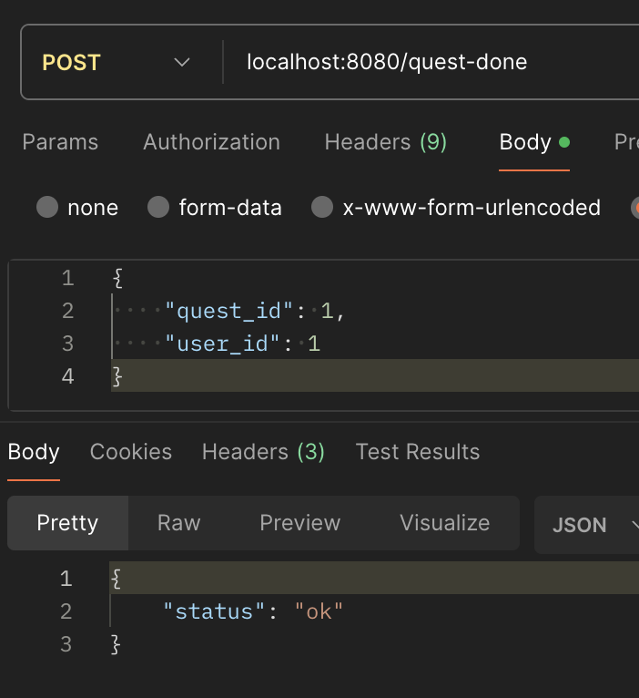
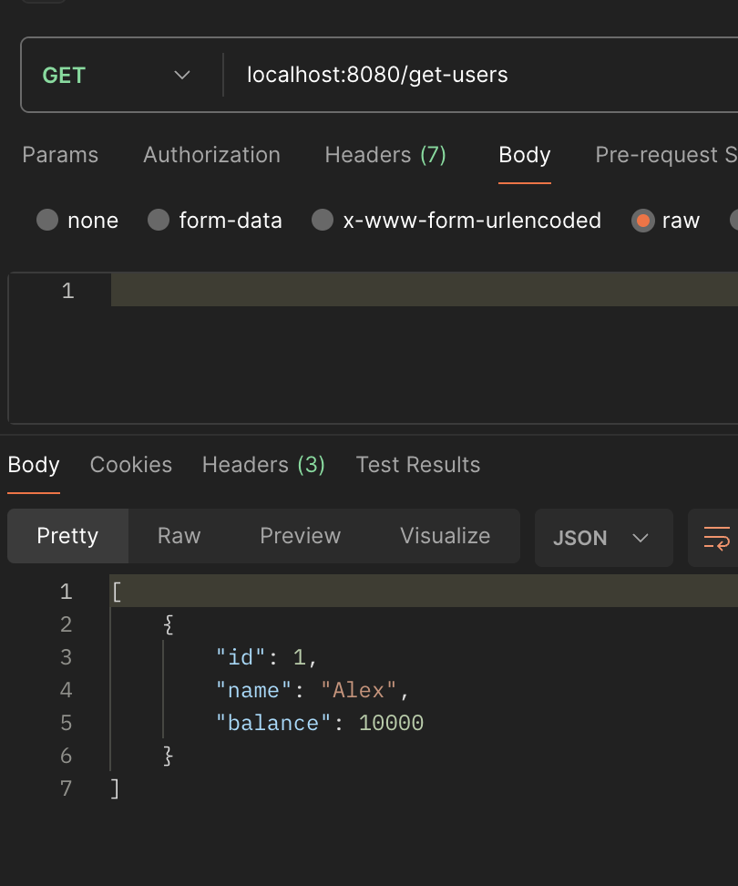
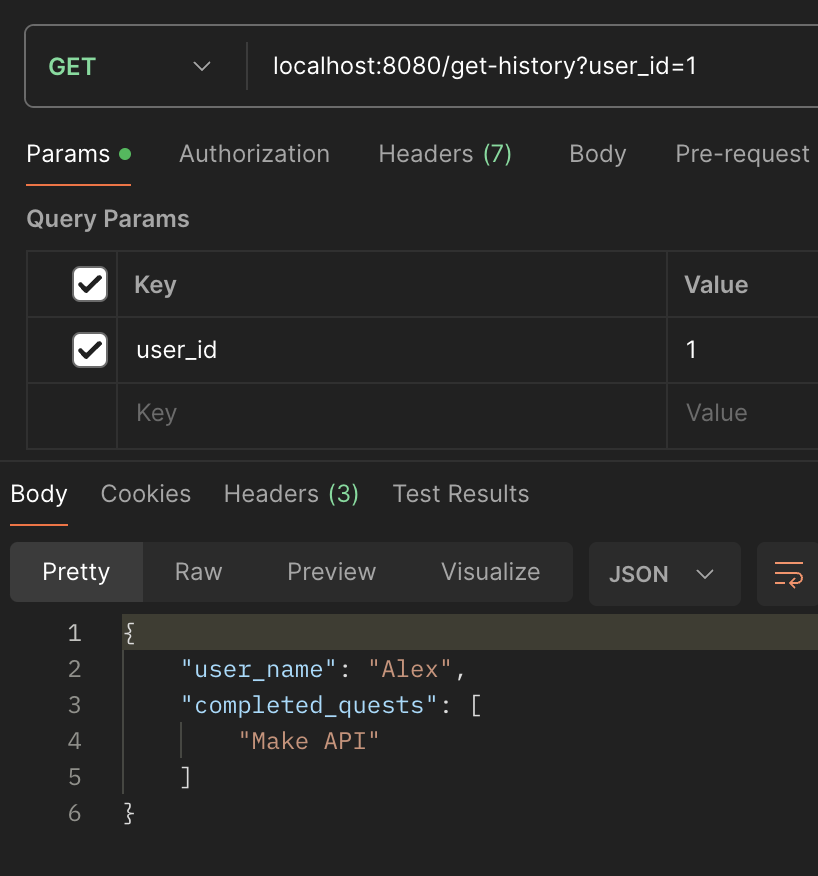

# UsersAndTasks
Test task for VK.

Для запуска нужно в корневом каталоге выполнить команду:

```bash
make
```

В Api 6 методов:

- Создание пользователя
- Создание задачи
- Сигнал сервису, что пользователь выполнил задачу
- Получение истории выполненных пользователем задач
- Получение списка всех задач
- Получение списка всех пользователей

## Создание пользователя:

нужно направить POST запрос на адрес localhost:8080/create-user с телом:
```json
{
    "name": "Имя"
}
```

## Создание задачи:

нужно направить POST запрос на адрес localhost:8080/create-quest с телом:
```json
{
    "name": "Название задачи",
    "cost": 100
}
```

## Сигнал сервису, что пользователь выполнил задачу:

нужно направить POST запрос на адрес localhost:8080/quest-done с телом:
```json
{
    "quest_id": 1,
    "user_id": 1
}
```

## Получение истории выполненных пользователем задач:

нужно направить GET запрос на адрес localhost:8080/get-history передав параметром id пользователя:

localhost:8080/get-history?user_id=1

## Получение списка всех задач:

нужно направить GET запрос на адрес localhost:8080/get-users.

## Получение списка всех пользователей:

нужно направить GET запрос на адрес localhost:8080/get-quests.

## Пример:

Создание пользователя:


Проверка, что пользователь создался:


Создание задачи:


Проверка, что задача создалась:


Сигнал сервису, что пользователь выполнил задачу:


Проверка, что баланс пользователя увеличился:


Получение истории выполненных пользователем задач:


